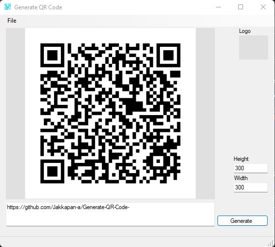

# Generate QR Code

This is a simple QR code generator. It is written in C# and uses the [ZXing.Net](https://github.com/micjahn/ZXing.Net/) library.

[QR Code](./images/program.jpg)

## Usage

Run the program and enter the text you want to encode. The program will generate a PNG file with the QR code.

## Contact

You can contact me at [github](https://github.com/jakkapan-a).

    

